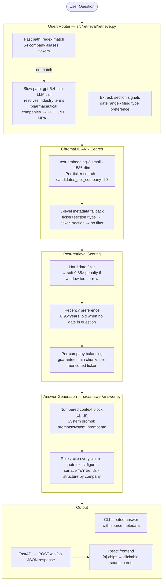

# SEC EDGAR RAG System

A retrieval-augmented generation system for answering business questions over SEC 10-K and 10-Q filings. Given a natural-language question, it retrieves the most relevant passages from a corpus of 246 filings across 54 major US companies and produces a grounded, cited answer.

Example questions:
- "What are the primary risk factors facing Apple, Tesla, and JPMorgan?"
- "How has NVIDIA's revenue and growth outlook changed over the last two years?"
- "What regulatory risks do the major pharmaceutical companies face?"

---

## Project structure

```
eliza_assignment/
├── src/
│   ├── config.py                        # Centralised paths and constants
│   ├── pipeline/                        # One-time data prep (run in order)
│   │   ├── chunk.py                     # Stage 1 — corpus → chunks.jsonl
│   │   ├── contextualize.py             # Stage 2 — chunks → enriched SQLite DB
│   │   └── embed.py                     # Stage 3 — DB → ChromaDB vector store
│   ├── retrieval/
│   │   └── retrieve.py                  # Hybrid retriever with LLM query routing
│   └── answer/
│       └── answer.py                    # Answer generator with inline citations
├── api/
│   └── main.py                          # FastAPI backend — POST /api/ask
├── frontend/                            # React + Vite + Tailwind UI
│   └── src/
│       ├── App.tsx
│       ├── api.ts
│       ├── types.ts
│       └── components/
│           ├── QueryBox.tsx
│           ├── AnswerPanel.tsx          # Renders [n] citation chips inline
│           ├── SourceCard.tsx
│           ├── SourceList.tsx
│           ├── CitationChip.tsx
│           ├── TickerBadge.tsx
│           └── ModelPicker.tsx
├── tests/
│   ├── contextualization_tester.py      # Test contextualizer on 2 documents
│   ├── embedding_tester.py              # Test embedder on a small sample
│   └── validate_db.py                   # Validate contextualized_chunks.db
├── scripts/
│   └── query_db.py                      # Inspect the SQLite DB (summary, search, browse)
├── prompts/
│   └── system_prompt.md                 # LLM system prompt — edit without touching Python
├── run_chunk.py                         # Root-level entry-point wrappers
├── run_contextualize.py
├── run_embed.py
├── run_answer.py
├── requirements.txt
├── docker-compose.yml
└── docs/
```

---

## Quick start

### 1. Install dependencies

```bash
python3 -m venv .venv
source .venv/bin/activate
pip install -r requirements.txt
cp .env.example .env   # fill in OPENAI_API_KEY
```

### 2. Run the data pipeline

```bash
# Stage 1 — chunk the corpus (~30s)
python -m src.pipeline.chunk

# Stage 2 — contextualise (~$2.43, resumes automatically if interrupted)
python -m src.pipeline.contextualize

# Stage 3 — embed into ChromaDB
python -m src.pipeline.embed              # OpenAI text-embedding-3-small (~$0.40)
python -m src.pipeline.embed --model local  # free, all-MiniLM-L6-v2
```

### 3. Ask a question (CLI)

```bash
python -m src.answer.answer "What are NVDA's primary risk factors?"
python -m src.answer.answer "Compare Apple and Tesla revenue" --model gpt-5.4
python -m src.answer.answer "MSFT cloud risks" --trace
```

### 4. Run the full stack (API + frontend)

```bash
# Terminal 1 — API
.venv/bin/uvicorn api.main:app --reload --port 8000

# Terminal 2 — Frontend (http://localhost:5173)
cd frontend && npm install && npm run dev
```

---

## Architecture



---

## Pipeline stages

### Stage 1 — Chunking

Reads every `*_full.txt` in `edgar_corpus/` and splits on SEC Item headers. Handles three PDF-to-text format variants (AAPL, BLK, AMZN styles). Financial tables kept as atomic chunks.

**Output:** `chunks.jsonl` — 50,676 chunks, median 1,859 chars

### Stage 2 — Contextualization

Enriches every chunk with two LLM-generated summaries prepended at embed time:

```
[DOCUMENT] Apple Inc. filed its 10-K annual report for fiscal year 2024...
[SECTION]  Item 1A covers hardware supply concentration, export controls...
<original chunk text>
```

**Output:** `contextualized_chunks.db` (SQLite, ~300 MB)  
**Cost:** ~$2.43 for the full corpus  
**Resume:** re-run the same command after any interruption — cache is automatic

### Stage 3 — Embedding

Embeds every enriched chunk and upserts into ChromaDB with full metadata. Parallel workers with exponential backoff. Resume support — skips already-indexed chunks.

| Backend | Model | Dims | Cost |
|---|---|---|---|
| `openai` (default) | text-embedding-3-small | 1536 | ~$0.40 |
| `local` | all-MiniLM-L6-v2 | 384 | free |

---

## Retrieval design

### LLM query routing

When no specific company name is found in the question, a `gpt-5.4-mini` call resolves industry/category terms against `_CORPUS_CONTEXT` — a sector map of all 54 corpus tickers. This makes category questions like "major pharmaceutical companies" or "chip makers" work without any hardcoded synonym lists.

### 10-K preference for risk factor queries

When the question is about risk factors (Item 1A signal, no explicit filing type), the retriever filters to 10-K filings. 10-Q Item 1A sections typically say "no material changes since the annual report" and contain almost no retrievable text — the 10-K has the full risk factor disclosure.

### Recency preference

When no date is mentioned in the question, a `0.95^years_old` multiplier is applied to every chunk's score. A 3-year-old chunk needs to score meaningfully higher (not just margin) to beat a current one.

---

## API

```
POST /api/ask
{
  "question": "string",
  "model": "gpt-5.4-mini",   // or "gpt-5.4"
  "top_k": 15
}

→ {
  "answer": "string with [1][2] citation markers",
  "sources": [
    {
      "index": 1,
      "ticker": "AAPL",
      "filing_type": "10-K (Annual Report)",
      "filing_date": "2025-10-31",
      "section": "Item 1A",
      "snippet": "first 400 chars of passage..."
    }
  ]
}
```

---

## Corpus

| Attribute | Value |
|---|---|
| Total filings | 246 |
| Annual reports (10-K) | 89 |
| Quarterly reports (10-Q) | 157 |
| Companies | 54 |
| Date range | 2021–2026 |

**Sectors:** Technology · Semiconductors · Financial Services · Healthcare/Pharma · Consumer/Retail · Energy · Industrial/Defense · Telecom · Automotive

**Companies with multi-year quarterly coverage:** AAPL, AMZN, DIS, GOOG, MSFT, NVDA, TSLA and others

---

## Environment variables

| Variable | Required for |
|---|---|
| `OPENAI_API_KEY` | Contextualization, OpenAI embedding, answer generation, LLM query routing |
| `COHERE_API_KEY` | `--reranker cohere` (optional) |

Copy `.env.example` to `.env`. Never commit `.env`.

---

## Development commands

```bash
# Run pipeline stages as modules
python -m src.pipeline.chunk
python -m src.pipeline.contextualize
python -m src.pipeline.embed

# Or via root-level wrappers
python run_chunk.py
python run_embed.py
python run_answer.py "question"

# Test and validation
python -m tests.contextualization_tester
python -m tests.embedding_tester
python -m tests.validate_db

# Inspect the DB
python -m scripts.query_db --summary
python -m scripts.query_db --ticker AAPL --section "Item 1A"
python -m scripts.query_db --search "revenue growth"
```
