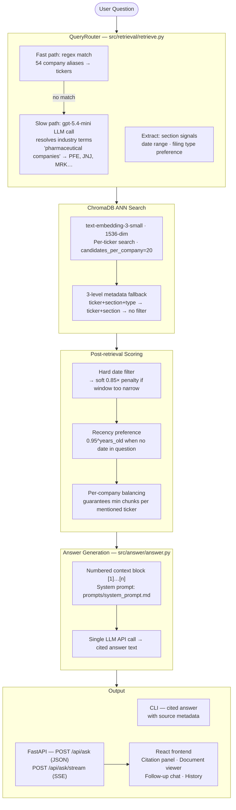

# SEC EDGAR RAG System

A retrieval-augmented generation system for answering business questions over SEC 10-K and 10-Q filings. Given a natural-language question, it retrieves the most relevant passages from a corpus of 246 filings across 54 major US companies and produces a grounded, cited answer — in a single LLM API call.

Example questions:
- "What are the primary risk factors facing Apple, Tesla, and JPMorgan?"
- "How has NVIDIA's revenue and growth outlook changed over the last two years?"
- "What regulatory risks do the major pharmaceutical companies face?"

---

## The single-LLM-call constraint

The assignment requires the final answer to come from **one LLM API call**. This is met exactly:

- **Retrieval** (runs first, no LLM): ChromaDB ANN search + BM25 keyword scoring + metadata filters
- **Query routing** (optional, retrieval-layer only): if no company names are found by regex, a `gpt-5.4-mini` call resolves industry terms like "pharmaceutical companies" → `[ABBV, JNJ, MRK, PFE, ...]`. This is retrieval infrastructure, not the answer.
- **Answer generation**: one call to the LLM (`gpt-5.4-mini` by default, swappable) with a numbered context block of the top-k retrieved passages and the system prompt. No tool use, no multi-step chain.

See `src/answer/answer.py` → `LLMClient.complete()` / `LLMClient.stream()`.

---

## Project structure

```
eliza_assignment/
├── src/
│   ├── config.py                        # Centralised paths and constants
│   ├── pipeline/                        # One-time data prep (run in order)
│   │   ├── chunk.py                     # Stage 1 — corpus → chunks.jsonl
│   │   ├── contextualize.py             # Stage 2 — chunks → enriched SQLite DB
│   │   └── embed.py                     # Stage 3 — DB → ChromaDB vector store
│   ├── retrieval/
│   │   └── retrieve.py                  # Hybrid retriever with LLM query routing
│   └── answer/
│       └── answer.py                    # Answer generator with inline citations
├── api/
│   ├── main.py                          # FastAPI app — /api/ask, /api/ask/stream
│   ├── auth.py                          # JWT auth (login, register, token validation)
│   ├── users.py                         # User table, roles, CRUD
│   ├── permissions.py                   # Model access + rate limits by role
│   ├── history.py                       # Single-turn conversation history
│   ├── sessions.py                      # Multi-turn follow-up chat sessions
│   ├── token_count.py                   # Context window helpers (tiktoken)
│   ├── token_usage.py                   # Token usage logging for admin dashboard
│   └── document.py                      # Full filing text viewer endpoint
├── frontend/                            # React + Vite + Tailwind UI
│   └── src/
│       ├── App.tsx                      # Root — routing, query state
│       ├── api.ts                       # Typed API client (fetch + SSE)
│       ├── types.ts                     # Shared TypeScript types
│       ├── components/
│       │   ├── QueryBox.tsx             # Question input + model picker
│       │   ├── AnswerPanel.tsx          # Renders answer with [n] citation chips
│       │   ├── CitationChip.tsx         # Clickable inline [n] chip
│       │   ├── CitationPanel.tsx        # Right-side panel: chunk list + document view
│       │   ├── SourceFooter.tsx         # Deduplicated filing chips under each answer
│       │   ├── ChatSession.tsx          # Multi-turn follow-up chat view
│       │   ├── ContextBar.tsx           # Context window usage bar (follow-up)
│       │   ├── FollowUpButton.tsx       # Opens a follow-up chat session
│       │   ├── ModelPicker.tsx          # Model selector (gpt-5.4-mini, gpt-5.4, etc.)
│       │   ├── Sidebar.tsx              # Nav sidebar with history, admin, settings
│       │   ├── TickerBadge.tsx          # Coloured company ticker pill
│       │   └── ThemeToggle.tsx          # Dark/light mode
│       ├── pages/
│       │   ├── AdminPage.tsx            # User management + token usage dashboard
│       │   ├── HistoryPage.tsx          # Past conversations
│       │   └── LoginPage.tsx            # Auth gate
│       └── contexts/
│           └── AuthContext.tsx          # JWT auth context
├── prompts/
│   ├── system_prompt.md                 # Single-turn answer prompt (edit without Python)
│   └── followup_system_prompt.md        # Conversational follow-up prompt
├── evals/
│   ├── build_test_set.py                # Generate synthetic Q&A pairs via LLM
│   ├── run_rag.py                       # Run all questions through the RAG pipeline
│   ├── run_judge.py                     # LLM-as-judge scoring (1–5 per answer)
│   ├── run_synthetic_eval.py            # End-to-end eval runner
│   └── data/                            # Generated test sets and eval results
├── tests/
│   ├── contextualization_tester.py
│   ├── embedding_tester.py
│   └── validate_db.py
├── scripts/
│   └── query_db.py                      # Inspect SQLite DB (summary, search, browse)
├── docs/                                # Design docs, plans, evaluation reports
├── run_chunk.py                         # Root-level entry-point wrappers
├── run_contextualize.py
├── run_embed.py
├── run_answer.py
├── CREDENTIALS.md                       # Demo login credentials (local dev only)
├── requirements.txt
└── docker-compose.yml
```

---

## Quick start

### 1. Install dependencies

```bash
python3 -m venv .venv
source .venv/bin/activate
pip install -r requirements.txt
cp .env.example .env   # fill in OPENAI_API_KEY
```

### 2. Run the data pipeline

```bash
# Stage 1 — chunk the corpus (~30s)
python -m src.pipeline.chunk

# Stage 2 — contextualise chunks (~$2.43, resumes automatically if interrupted)
python -m src.pipeline.contextualize

# Stage 3 — embed into ChromaDB
python -m src.pipeline.embed              # OpenAI text-embedding-3-small (~$0.40)
python -m src.pipeline.embed --model local  # free, all-MiniLM-L6-v2
```

### 3. Ask a question (CLI)

```bash
python -m src.answer.answer "What are NVDA's primary risk factors?"
python -m src.answer.answer "Compare Apple and Tesla revenue" --model gpt-5.4
python -m src.answer.answer "MSFT cloud risks" --trace
```

### 4. Run the full stack (API + frontend)

```bash
# Terminal 1 — API
.venv/bin/uvicorn api.main:app --reload --port 8000

# Terminal 2 — Frontend (http://localhost:5173)
cd frontend && npm install && npm run dev
```

Default demo login: **admin@example.com / admin-pass-123** (see `CREDENTIALS.md` for all roles).

---

## Example request (ready to execute)

### CLI

```bash
python run_answer.py "What are the primary risk factors facing Apple, Tesla, and JPMorgan, and how do they compare?"
```

### HTTP (curl)

```bash
# Step 1 — get a token
TOKEN=$(curl -s -X POST http://localhost:8000/auth/login \
  -H "Content-Type: application/x-www-form-urlencoded" \
  -d "username=admin@example.com&password=admin-pass-123" \
  | python3 -c "import sys,json; print(json.load(sys.stdin)['access_token'])")

# Step 2 — ask a question
curl -s -X POST http://localhost:8000/api/ask \
  -H "Content-Type: application/json" \
  -H "Authorization: Bearer $TOKEN" \
  -d '{"question": "What are the primary risk factors facing Apple, Tesla, and JPMorgan, and how do they compare?", "model": "gpt-5.4-mini", "top_k": 15}' \
  | python3 -m json.tool
```

### Streaming (SSE — what the UI uses)

```bash
curl -s -X POST http://localhost:8000/api/ask/stream \
  -H "Content-Type: application/json" \
  -H "Authorization: Bearer $TOKEN" \
  -d '{"question": "How has NVIDIAs revenue and growth outlook changed over the last two years?", "model": "gpt-5.4-mini"}' \
  --no-buffer
```

---

## Architecture



---

## Pipeline stages

### Stage 1 — Chunking

Reads every `*_full.txt` in `edgar_corpus/` and splits on SEC Item headers. Handles three PDF-to-text format variants (AAPL inline, BLK line-start, AMZN pipe-delimited). Financial tables kept as atomic chunks.

**Output:** `chunks.jsonl` — 50,676 chunks, median 1,859 chars

### Stage 2 — Contextualization

Enriches every chunk with two LLM-generated summaries prepended at embed time:

```
[DOCUMENT] Apple Inc. filed its 10-K annual report for fiscal year 2024...
[SECTION]  Item 1A covers hardware supply concentration, export controls...
<original chunk text>
```

**Output:** `contextualized_chunks.db` (SQLite, ~300 MB)
**Cost:** ~$2.43 for the full corpus
**Resume:** re-run the same command after any interruption — cache is automatic

### Stage 3 — Embedding

Embeds every enriched chunk and upserts into ChromaDB with full metadata. Parallel workers with exponential backoff. Resume support — skips already-indexed chunks.

| Backend | Model | Dims | Cost |
|---|---|---|---|
| `openai` (default) | text-embedding-3-small | 1536 | ~$0.40 |
| `local` | all-MiniLM-L6-v2 | 384 | free |

---

## Retrieval design

### LLM query routing

When no specific company name is found in the question, a `gpt-5.4-mini` call resolves industry/category terms against `_CORPUS_CONTEXT` — a sector map of all 54 corpus tickers. This makes category questions like "major pharmaceutical companies" or "chip makers" work without any hardcoded synonym lists.

### 10-K preference for risk factor queries

When the question is about risk factors (Item 1A signal, no explicit filing type), the retriever filters to 10-K filings. 10-Q Item 1A sections typically say "no material changes since the annual report" and contain almost no retrievable text — the 10-K has the full risk factor disclosure.

### Recency preference

When no date is mentioned in the question, a `0.95^years_old` multiplier is applied to every chunk's score. A 3-year-old chunk needs to score meaningfully higher to beat a current one.

### Per-company balancing

When multiple companies are mentioned, a minimum chunk quota per ticker is enforced before the global top-k cut. This prevents a single company from dominating the context block.

---

## API

All endpoints require a JWT bearer token (`POST /auth/login` to obtain one).

### Answer endpoints

```
POST /api/ask
{
  "question": "string",
  "model":    "gpt-5.4-mini",   // or "gpt-5.4", "gpt-4o", "claude-*"
  "top_k":    15
}
→ { "answer": "...[1][2]...", "sources": [ { "index": 1, "ticker": "AAPL", ... } ] }

POST /api/ask/stream            // SSE — what the UI uses
→ data: {"type":"sources", "sources":[...]}
  data: {"type":"chunk",   "text":"..."}
  data: {"type":"citations","valid":[1,2,4]}
  data: {"type":"saved",   "conv_id":42}
  data: {"type":"done"}
```

### History

```
GET  /api/history               // list past conversations
GET  /api/history/recent        // 5 most recent (sidebar)
GET  /api/history/{id}
DELETE /api/history/{id}
```

### Follow-up sessions (multi-turn chat)

```
POST /api/sessions              // create session (seeds from conv_id)
GET  /api/sessions/{id}
POST /api/sessions/{id}/message // streaming follow-up (SSE)
DELETE /api/sessions/{id}
```

### Document viewer

```
GET /api/document?ticker=AAPL&filing_type=10-K&filing_date=2024-11-01&section=Item+1A
→ { "text": "full filing body...", "section_id": "Item 1A", ... }
```

### Admin (admin role only)

```
GET    /admin/users
POST   /auth/register
PATCH  /admin/users/{id}
DELETE /admin/users/{id}
GET    /admin/token-usage       // token consumption by user and model
```

---

## Prompt engineering

See `docs/system_prompt_change_history.md` for the full log (v1 → v5 + followup/v1).

**Key iterations:**
- **v1 → v2**: Replaced brevity rule with thoroughness — model was skipping available numbers due to "keep it concise"
- **v2 → v3**: Added data context block (corpus coverage, section ID map) — model didn't know which items contain revenue vs. risk data
- **v3 → v4**: Extended context to cover 10-Q section structure — NVDA revenue lives in Item 2, not Item 7
- **v4 → v5**: LLM query routing in the retrieval layer — category questions ("major pharma") previously saturated on one company
- **followup/v1**: Separate conversational prompt for multi-turn sessions — single-turn prompt's formal structure reads badly in conversation

Final prompts: `prompts/system_prompt.md` (single-turn), `prompts/followup_system_prompt.md` (follow-up)

---

## Quality evaluation

See `docs/eval_analysis.md` for the full report.

**Method:** 160 synthetic Q&A pairs generated from corpus filings (by question type: risk, financial, comparative, temporal, regulatory). Each RAG answer scored 1–5 by an LLM judge against a reference answer from the same filing.

**Results (run 20260515_101548):**

| Metric | Value | Target |
|---|---|---|
| Mean judge score | 3.47 / 5.0 | ≥ 3.5 |
| % scoring ≥ 4 | 60.6% | ≥ 60% ✓ |
| % scoring ≤ 2 | 29.4% | ≤ 15% |

**Failure modes:** Financial-table and temporal-comparison questions suffer most — the chunker splits tables across boundaries, and the retriever sometimes misses older filings when the recency penalty is too aggressive.

**Mitigations applied:** Retrieval gap patching (per-company balance, section signal boosting), system prompt updated to surface year-over-year trends explicitly.

---

## Auth and access control

Three roles, enforced at the API layer:

| Role | Corpus access | Models | Rate limit |
|---|---|---|---|
| `admin` | All 54 companies | All | None |
| `analyst` | All 54 companies | All | 200 req/hr |
| `viewer` | Restricted ticker list | gpt-5.4-mini only | 20 req/hr |

Demo credentials are in `CREDENTIALS.md`.

---

## Corpus

| Attribute | Value |
|---|---|
| Total filings | 246 |
| Annual reports (10-K) | 89 |
| Quarterly reports (10-Q) | 157 |
| Companies | 54 |
| Date range | 2021–2026 |

**Sectors:** Technology · Semiconductors · Financial Services · Healthcare/Pharma · Consumer/Retail · Energy · Industrial/Defense · Telecom · Automotive

---

## Environment variables

| Variable | Required for |
|---|---|
| `OPENAI_API_KEY` | Contextualization, OpenAI embedding, answer generation, LLM query routing |
| `JWT_SECRET_KEY` | API auth token signing |
| `COHERE_API_KEY` | `--reranker cohere` (optional) |

Copy `.env.example` to `.env`. Never commit `.env`.

---

## Development commands

```bash
# Pipeline
python -m src.pipeline.chunk
python -m src.pipeline.contextualize
python -m src.pipeline.embed

# CLI answer
python run_answer.py "question here"

# API server
.venv/bin/uvicorn api.main:app --reload --port 8000

# Frontend
cd frontend && npm run dev

# Tests and validation
python -m tests.contextualization_tester
python -m tests.embedding_tester
python -m tests.validate_db

# Inspect the DB
python -m scripts.query_db --summary
python -m scripts.query_db --ticker AAPL --section "Item 1A"
python -m scripts.query_db --search "revenue growth"

# Evaluation
python -m evals.run_synthetic_eval
```
